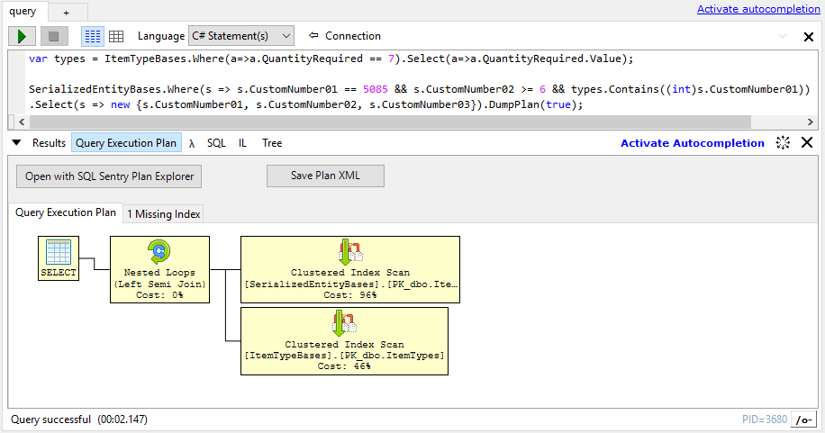
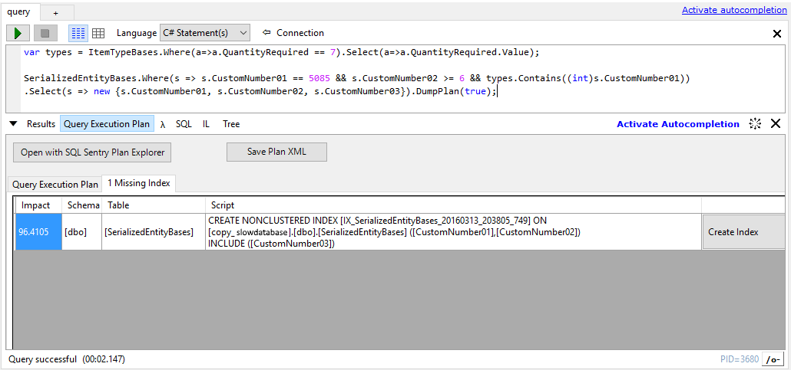

# QueryPlanVisualizer  
SQL Server query execution plan visualizer for LINQPad.

## Features
* View query execution plan inside LINQPad
* View missing indexes for query
* Create missing indexes directly from LINQPad
* Open plan in SQL Server Management Studio or other default app
* Save plan to xml file

## Getting Started
### Install from Nuget
If you have Developer or higher edition of LINQPad you can use `LINQPadQueryPlanVisualizer` package from Nuget 
to add the visualizer to your queries.

### Install as plugin
To install the visualizer as a LINQPad plugin download the [latest release](https://github.com/Giorgi/QueryPlanVisualizer/releases/latest) and drop the visualizer dll directly inside LINQPad's plugins folder (by defalt found at `My Documents\LINQPad Plugins`). The plugin will be automatically available in all queries.

## Viewing query plan
To view query plan or missing indexes call static `QueryPlanVisualizer.DumpPlan(query)` method or call `DumpPlan` extension method on any `IQueryable` instance. You will also need to add `ExecutionPlanVisualizer` to namespaces list (click F4 to open the dialog). If you want to dump query result too just pass `true` as a second parameter.

Query execution plan:

Missing index:

